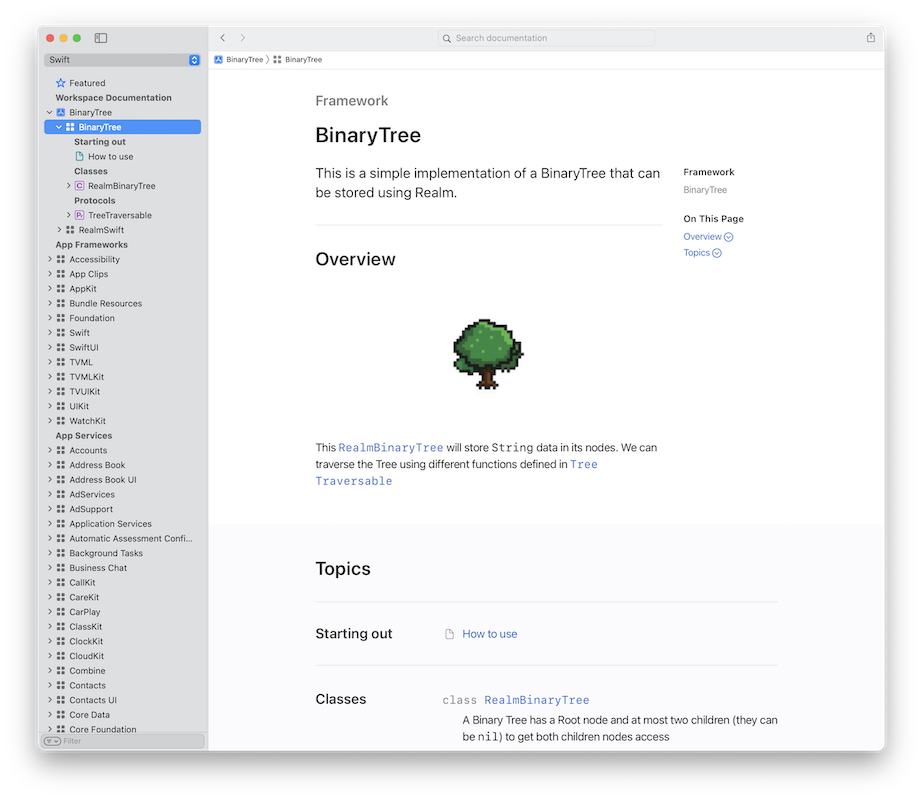
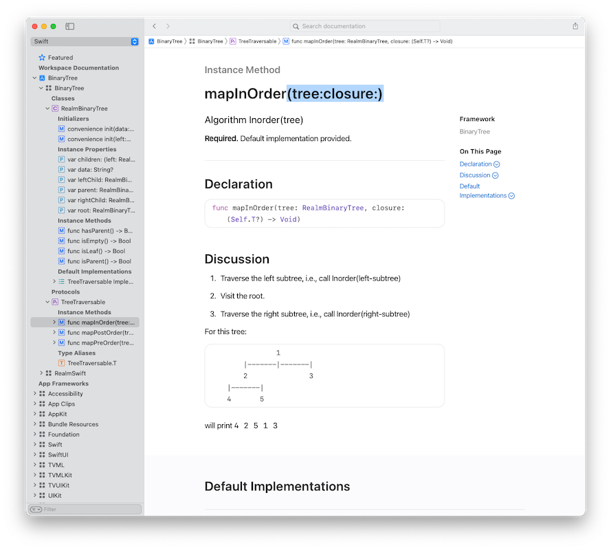

# BinaryTree

A simple implementation of a Realm-backed [Binary Tree](https://en.wikipedia.org/wiki/Binary_tree).
 
This library __is a demo on how to use DocC__. Also shows how to integrate Realm in your Libraries. See how your new docs will look!

| |  |
| --- | --- | 
| |  |

You can read a series of posts about how to create a small guessing game in the Realm/MongoDB blog, starting with [Creating a framework that uses Realm as a 3rd party dependency](https://www.mongodb.com/developer/how-to/adding-realm-as-dependency-ios-framework/)

Generated DocC file can be found [here](https://github.com/mongodb-developer/realm-binary-tree-docc)

## Resources

To learn more about Realm/MongoDB you have all these fantastic resources:

- [💻 MongoDB DeveloperHub, central point for everything MongoDB/Realm related](https://www.mongodb.com/developer)
- [💬 The MongoDB Forums](https://www.mongodb.com/community/forums/)
- [👩‍💻 Developer Blog](https://developer.mongodb.com/learn/?content=Articles#main)
- [🎓 MongoDB University](https://university.mongodb.com/)
- [📺 Youtube Channel](https://www.youtube.com/c/MongoDBofficial)
- [🎧 The MongoDB Podcast](https://developer.mongodb.com/learn/?content=Podcasts#main)
